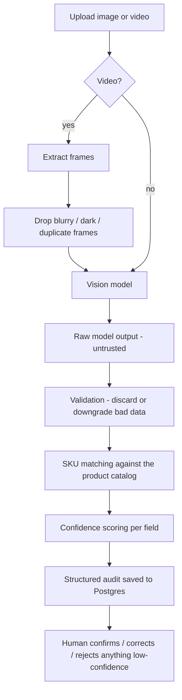

# Vision AI Shelf Audit

A field rep takes a photo or a short video of a store shelf. This app turns
that into a structured audit: what products are on the shelf, how many
facings, what's missing, what promos are running, and how confident the
system actually is about each of those claims.

The point of this project isn't a pretty UI. It's a pipeline that:

- looks at a real image or video and extracts what it actually sees
- never guesses a brand or SKU it can't support with evidence
- scores its own confidence per field, not just per audit
- checks its guesses against a product catalog before trusting them
- lets a human confirm, correct, or reject anything it wasn't sure about
- saves everything to a real database (Supabase/Postgres)

If something can't be identified, the system says so:

```json
{ "value": null, "confidence": 0.15, "reason": "label obscured by glare" }
```

That's on purpose. A wrong guess is worse than an honest "I don't know."

---

## Quick start

You need Python 3.11+ and Node 18+. Nothing else is required — no API key,
no Supabase project. Without them the app runs in mock mode: same pipeline,
same UI, fixture data instead of a real model call.

**Backend**

```bash
cd backend
python -m venv venv
venv\Scripts\activate            # macOS/Linux: source venv/bin/activate
pip install -r requirements.txt
copy .env.example .env           # macOS/Linux: cp .env.example .env
uvicorn main:app --reload --port 8000
```

**Frontend** (in a second terminal)

```bash
cd frontend
npm install
npm run dev
```

Open `http://localhost:5173`. Pick a store, upload a shelf photo or video,
and watch it process.

Check `http://localhost:8000/api/health` any time to see which vision
provider and database backend are currently active.

**Or with Docker**, if you'd rather not set up Python/Node locally:

```bash
copy backend\.env.example backend\.env   # macOS/Linux: cp backend/.env.example backend/.env
docker compose up --build
```

Backend on `http://localhost:8000`, frontend on `http://localhost:5173`.
Same mock-mode-by-default behavior - edit `backend/.env` and re-run to turn
on a real provider or a real Supabase project.

---

## How it works



Raw model output is never trusted blindly - it could be wrong, incomplete,
or malformed. Confidence scoring factors in the catalog match and whether
multiple frames agree with each other.

Every extracted value looks the same, whether it's a brand, a price, or a
promo:

```json
{ "value": "Tito's", "confidence": 0.9, "reason": "brand label clearly visible" }
```

Nothing skips this shape. If the model can't tell, `value` is `null` and
confidence is forced low — that's enforced in code, not just a convention
someone could forget to follow.

For products specifically, there's a bit more detail: a breakdown of *why*
the confidence score is what it is, and a short evidence list:

```json
{
  "overall_confidence": 0.83,
  "confidence": {
    "factors": { "vision": 0.89, "ocr": 0.7, "catalog_match": 0.97, "frame_consistency": 1.0 }
  },
  "evidence": [
    "Brand 'Tito's' identified - label clearly visible on multiple bottles",
    "Matched catalog entry 'titos vodka' with fuzzy score 100/100"
  ]
}
```

Nothing in that evidence list is invented for display - it's built from
signals the pipeline already computed while processing the frame.

---

## Vision providers

The actual "look at this image" step is swappable. Three providers exist
behind one shared interface:

| Provider | What it does | Needs |
| --- | --- | --- |
| `mock` | Deterministic fixture responses, no network call | Nothing |
| `openai` | Real inference via OpenAI vision model | `OPENAI_API_KEY` |
| `groq` | Real inference via Llama-4-Scout (fast, free tier) | `GROQ_API_KEY` |

Set `VISION_PROVIDER` in `backend/.env`, or leave it on `auto` and it'll pick
OpenAI, then Groq, then fall back to mock — whichever key you've actually
set. No code changes either way.

```
OPENAI_API_KEY=sk-...
# or
GROQ_API_KEY=gsk_...
```

Nothing downstream of the vision call (validation, SKU matching, confidence,
the database) knows or cares which provider ran. That's the whole point of
keeping it behind one interface: the model is a replaceable part, the logic
around it is the actual product.

**There's also a dev-only switch in the app itself** — top right of the
header, marked "DEV". It lets you flip between Mock and whichever real
provider you've configured, live, without restarting the backend, which is
handy for a demo. This is not something a field rep would ever see or use in
production; a real deployment would just set `VISION_PROVIDER` once and
leave it alone.

---

## Project layout

```
backend/
  main.py            app entrypoint, routes wired up here
  config.py          all settings, env-driven, sane defaults
  api/                route handlers only, no business logic
  vision/             the pipeline: client.py + providers/, prompts, validation, confidence
  video/              frame extraction + quality filtering
  sku/                catalog + fuzzy matching
  database/           repository + storage (Supabase, or in-memory for local dev)
  models/             Pydantic schemas
  tests/              pytest suite

frontend/
  src/api/            typed API client
  src/types/          TypeScript types mirroring the backend schemas
  src/components/     UploadZone, ProductCard, AuditTrace, FrameGallery, etc.
  src/pages/          UploadPage, AuditResultPage, HistoryPage
```

---

## Tests

```bash
cd backend
venv\Scripts\python.exe -m pytest -v
```

~100 tests, all offline (no real network calls). They cover provider
selection, frame quality filtering, confidence scoring, SKU matching, schema
validation, and the human review API.

---

## API

| Method & path | What it does |
| --- | --- |
| `GET /api/accounts` | List stores |
| `GET /api/products` | List the product catalog |
| `POST /api/audits` | Upload media, kicks off processing |
| `GET /api/audits/{id}` | Check audit status / get the result |
| `GET /api/audits/{id}/trace` | See exactly what the pipeline did, step by step |
| `GET /api/audits` | List past audits |
| `POST /api/audits/{id}/feedback` | Confirm / correct / reject a field |
| `GET /api/audits/{id}/feedback` | List feedback for an audit |
| `GET/POST /api/settings/vision-provider` | Dev-only provider switch |
| `GET /api/health` | Current provider + database status |

---

## Things worth knowing

- **A `null` value never means "confident."** It's enforced at the schema
  level - you can't accidentally construct a "confidently unknown" field.
- **The model's raw output never touches the database directly.** It goes
  through validation first, which can discard or downgrade bad data instead
  of crashing on it.
- **Ambiguous SKU matches are refused, not guessed.** If two catalog entries
  are too close to call, the match comes back `null` with a reason.
- **Multiple video frames agreeing on something raises confidence; one frame
  claiming something loudly doesn't.**
- **Human corrections are logged separately** (`audit_feedback`), they never
  rewrite what the AI originally said. You can always see both.

## Known limitations

- Mock mode uses a small, fixed set of fixture responses, not infinite variety.
- Background processing runs in-process (FastAPI `BackgroundTasks`), not a
  real job queue — fine for a prototype, not for scale.
- Video frames are analyzed one at a time, not in parallel.
- There's no separate OCR pass — text legibility is approximated from what
  the vision model itself reports.
- No auth on the API. No offline upload queue.

## More detail

- [`docs/DEMO.md`](docs/DEMO.md) — a 5-minute walkthrough script
- [`docs/DESIGN_NOTES.md`](docs/DESIGN_NOTES.md) — architecture diagram, buy
  vs. build reasoning, latency budget, failure modes, an offline strategy,
  and how you'd actually evaluate this thing in production
