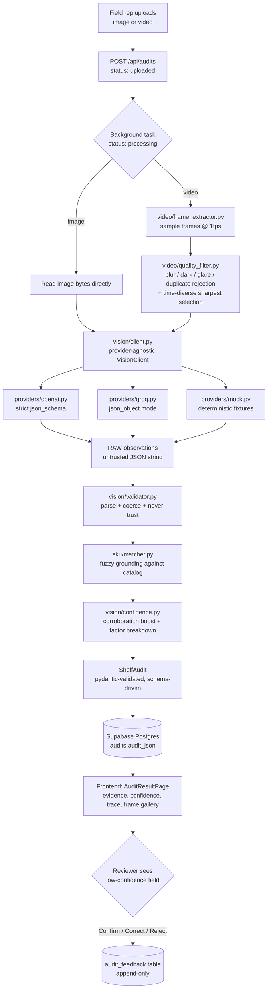

# Design notes

The README covers how to run this. This covers the decisions behind it: the
architecture end to end, what got bought vs. built, roughly how long each
stage takes, what happens when things go wrong, an offline strategy for
field use, and how you'd actually measure whether this works.

## Architecture

The rule behind every arrow above: nothing left of "RAW observations" is
trusted past that point. Whatever vision provider is configured only ever
hands back an untrusted JSON string. Everything from `vision/validator.py`
onward is pydantic-validated, and a field that fails validation becomes
`{value: null, confidence: low, reason: "<why>"}` instead of getting dropped
or guessed at.

## Buy vs. build

| Decision | Choice | Why |
| --- | --- | --- |
| Object/text recognition on shelf photos | Buy (GPT-4o / Llama-4-Scout via Groq) | Training a brand/product detector needs a labeled dataset this project doesn't have. A general-purpose VLM already reads label text, estimates facings, and reasons in natural language about occlusion and glare - which is exactly the "explain your uncertainty" behavior the system depends on. Rebuilding that would be out of scope; the differentiated work is everything around it. |
| Frame quality filtering (blur/brightness/dedup) | Build | Cheap and deterministic, and it needs to run *before* the expensive vision call. A model call is the wrong tool for "is this frame too dark" - explicit, tunable, unit-testable thresholds are more debuggable than delegating it to a prompt. |
| Schema validation / anti-hallucination enforcement | Build | This is the actual product requirement, not something you can buy off the shelf. `vision/validator.py` and the null-forces-low-confidence rule in `models/shelf_audit.py` are the core of this system - no vendor's "structured output" mode enforces a business rule like "never let the model's own confidence claim reach the database unexamined." |
| SKU grounding / fuzzy matching | Build (on top of a bought library) | `rapidfuzz` handles the string distance math. The actual matching policy - what counts as confident, what counts as too ambiguous to trust, the margin between the top two candidates - is domain logic specific to this catalog, and had to be built and tuned by hand. |
| Confidence calibration (factors + corroboration) | Build | The four-factor breakdown (vision, ocr, catalog_match, frame_consistency) is assembled from signals the pipeline already computes. There's no vendor product that tells you how much catalog similarity contributed to one specific score. |
| Persistence / auth / storage | Buy (Supabase: Postgres + Storage) | Undifferentiated infrastructure. Building a database or an object store for this project would just be wasted scope. |

There are hosted shelf-recognition APIs that would satisfy a more literal
reading of "buy." I didn't use one on purpose - the actual ask here (schema-
driven extraction, field-level confidence, grounding, honest uncertainty) is
exactly what a black-box vendor API would hide. Buying the general vision
capability and building the audit-specific trust layer on top is the right
split for this brief.

## Latency budget

Rough numbers for a single request - a ~3MB phone photo, or a 15-second
1080p walkthrough video - run locally against `gpt-4o`:

| Stage | Image | Video (15s @ 1fps sampling) |
| --- | --- | --- |
| Upload (client -> API) | 100-400ms | 0.5-3s (larger file) |
| Storage write (Supabase Storage or local disk) | 20-80ms | 100-400ms |
| Frame extraction (OpenCV decode + sample) | n/a | 150-500ms for ~15 frames |
| Quality filtering (blur/brightness/hash) | ~5ms | 20-60ms for ~15 frames |
| Vision inference (per selected frame) | 1.5-4s x 1 frame | 1.5-4s x up to 5 frames, sequential |
| Validation + grounding + calibration | <10ms | <30ms |
| DB write | 30-100ms | 30-100ms |
| **Total** | **~2-5 seconds** | **~10-25 seconds** |

Vision inference dominates, and it's the one place this system trades
latency for something else on purpose: video frames are analyzed
sequentially rather than concurrently, so per-frame progress
("analyzing frame 3/5") is real and visible in the UI, and the mock and real
code paths stay identical. Parallelizing per-frame calls (e.g.
`asyncio.gather` over an async vision client) is the obvious next step if
p95 latency ever became a real concern - not done here because it would
make the pipeline harder to read and test for not much benefit at this
scale.

## Failure modes

Each of these is handled by refusing to guess, not by trying harder to guess right:

- **Glare** - a bright reflection over a label. The model is told (and, on
  the OpenAI path, schema-constrained) to report `value: null` with a reason
  like "label obscured by glare" instead of inferring the brand from bottle
  shape alone. On video, `video/quality_filter.py`'s brightness-ceiling check
  also rejects blown-out frames before they ever reach the model.
- **Blur** - motion blur from a handheld walkthrough. Caught two ways: at the
  frame level (Laplacian-variance `blur_score` rejects the whole frame
  during video processing) and at the field level (the validator forces
  `confidence_level: low` whenever `value` is `null`, regardless of what the
  model itself claimed).
- **Hidden or occluded labels** - a bottle turned backward, or blocked by
  another product. This is what `reason` strings like "product partially out
  of frame" are for. The schema has no way to express "I'm guessing," only
  "here's what I saw and how sure I am" - which structurally discourages
  papering over occlusion with a plausible-sounding guess.
- **Similar SKUs** - two vodka brands with similar bottles, or a 750ml vs.
  1.75L size call. `sku/matcher.py` refuses the match if the top two
  fuzzy-match candidates are within `sku_match_ambiguous_margin` of each
  other, rather than picking whichever scored one point higher.
- **Multi-frame disagreement** - a video says "Corona" in frame 2 but
  "Modelo" in frame 5 for the same shelf slot. `vision/extractor.py` groups
  observations by `(brand, product_name)`, so disagreeing frames produce two
  separate, low-corroboration entries instead of one falsely confident
  merged one. The `frame_consistency` factor makes this visible - a product
  seen in 1 of 5 frames scores lower than one confirmed in all 5.

## Offline strategy

This prototype assumes network connectivity at upload time - there's no
offline queue implemented. If this were extended for a rep working
somewhere with no signal, the natural design is:

1. **Local queue on capture.** Write the captured media plus a
   locally-generated UUID to local storage (IndexedDB on web, filesystem on
   native) immediately on capture, before attempting any network call.
   Capture shouldn't block on connectivity.
2. **Background retry with backoff.** A queue worker retries
   `POST /api/audits` for each queued item on an exponential backoff,
   removing it from the local queue only once the server has durably
   acknowledged it - returned an `audit_id` - not just once the HTTP request
   appeared to succeed. An idempotency key (the client-generated UUID)
   dedupes on the server side.
3. **Optimistic local status.** Show the audit as "queued, will upload when
   back online" using the local UUID, and swap in the server's real
   `audit_id`/status once it syncs, so the rep's workflow never stalls
   waiting for connectivity.
4. **Eventual sync, never silent loss.** Every queued item stays visible in
   a local "pending uploads" list until confirmed synced. A permanently
   failed upload (corrupt file, etc.) surfaces as an explicit error the rep
   has to acknowledge - never something that just quietly disappears. Same
   "never fake success" principle as the vision confidence, applied to
   connectivity instead.

## Evaluation metrics

How you'd actually tell if this pipeline is good, beyond "the demo looked right":

- **SKU precision** - of the products reported with a non-null
  `matched_sku`, what fraction are actually correct? Measured against a
  held-out set of shelf photos with ground-truth labels. This is the metric
  that punishes false confidence hardest - a wrong match is worse than a
  null one, and precision (not recall) is what exposes that.
- **SKU recall** - of the products actually present and in the catalog, what
  fraction did the system match? Recall misses are more forgivable here than
  precision misses, given the system's stated goal - `null` is an
  acceptable miss; a wrong guess isn't.
- **False positive rate** - specifically for `out_of_stock_signals` and
  `compliance_flags`, since those drive real action (a rep or manager might
  restock or escalate). What fraction of reported signals turn out not to be
  real when checked in person? This matters more than plain accuracy because
  acting on a false out-of-stock signal has a real cost.
- **Confidence calibration** - bucket every field by its reported
  `confidence_level` against ground-truth correctness, and check that "high"
  fields really are right most of the time, and "low" fields much less
  often. A well-calibrated system's buckets should be monotonic with
  observed accuracy - if "medium" turns out more accurate than "high," the
  thresholds (or the factor weighting in `vision/confidence.py`) need
  retuning. The `audit_feedback` table (human Confirm/Correct/Reject
  decisions) is exactly the data this evaluation would run against in
  production - every correction is a labeled example of where confidence and
  correctness diverged.

## Things I deliberately didn't build

- **No separate `media` table.** Each audit has exactly one source media
  asset today (`audits.media_url`), so a normalized `media` table would just
  add a join with no query benefit. If an audit ever needed multiple media
  files (a photo *and* a video for one visit), that's the trigger to add
  it - not before.
- **No separate OCR engine.** The `ocr` confidence factor is derived from
  the size-text legibility signal the vision model already reports, not a
  distinct OCR pass (Tesseract, etc.) over cropped label regions. The model
  reads label text and recognizes the product in one call; bolting on a
  second text-reading pipeline would add latency and complexity for an
  unclear accuracy win. This approximation is flagged everywhere it's
  surfaced, including in the `ConfidenceFactors` docstring.
- **No "home brand" vs. competitor model.** The catalog doesn't track which
  brand the field rep represents vs. which are competitors - "Competitor
  Activity" in the UI just surfaces all promotion/signage/pricing activity
  observed on shelf, rather than inventing an ownership split the data
  doesn't support. Making that distinction up would be exactly the kind of
  confident-but-unsupported claim this system is supposed to avoid.
